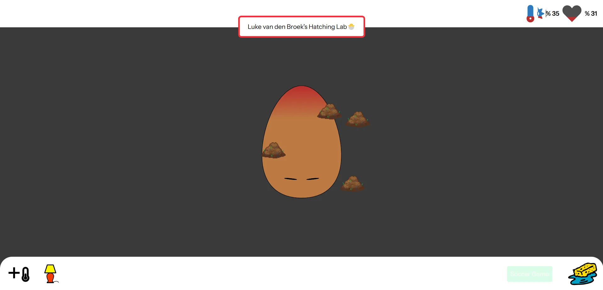
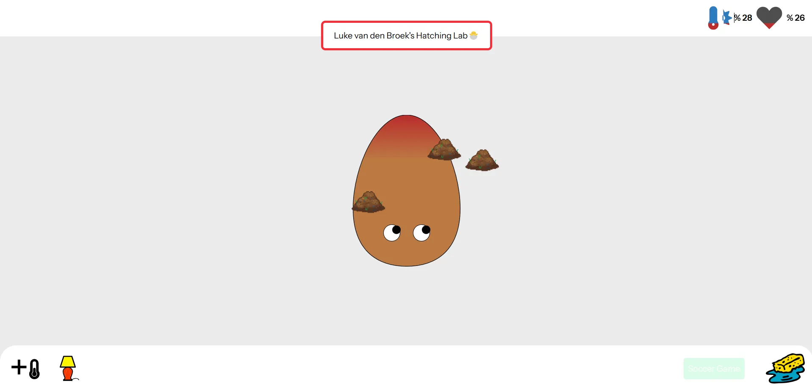
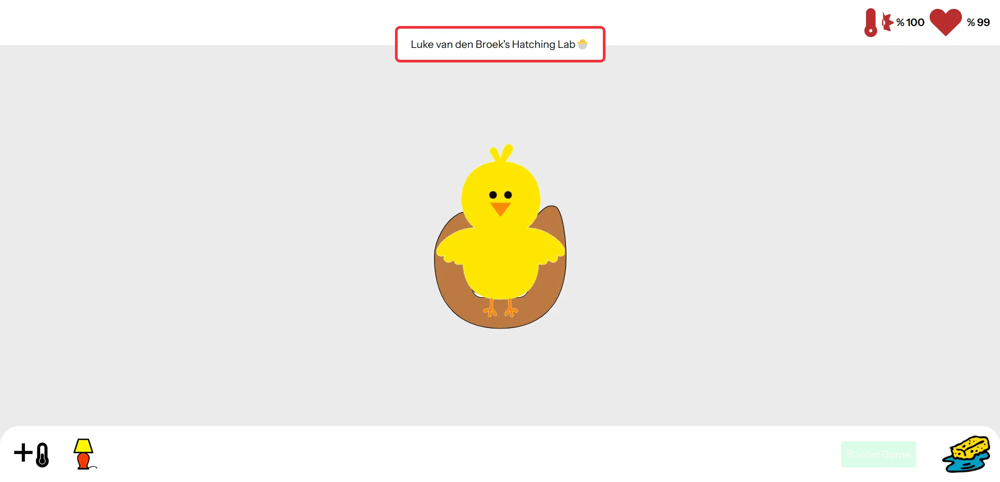
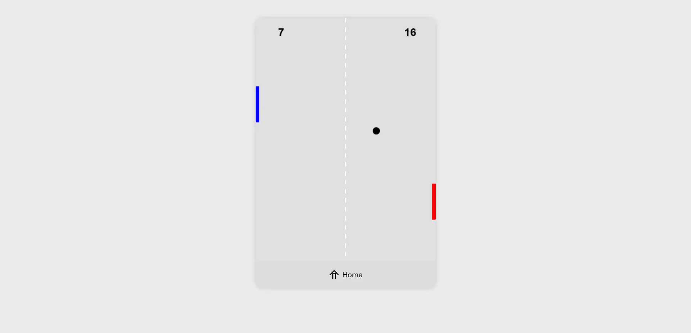

# 🐣 Egg Life – SintLucas Hackathon 2025

**An interactive browser-based pet simulator developed in just 48 hours during the annual SintLucas Hackathon.**

For this challenge, the goal was to create a game or website around the theme **"eggs"**. Inspired by the nostalgic mobile game *Pou*, I designed a digital egg pet that reacts to user interactions. Throughout the process, I gained valuable insights into project leadership, decision-making under pressure, and focusing on core functionality in a limited timeframe.

> Special thanks to [Samed Bozaslan](https://github.com/SamedBozaslan) for his contribution to the team.

## 🎮 Game Features

- 🧼 **Clean the egg** – Keep your egg happy and shiny.
- 🎲 **Play mini-games** – Boost its mood through interaction.
- 😴 **Let the egg sleep** – Recharge energy through rest.
- 🐣 **Hatch the egg** – A chick appears once the egg is well cared for.

## 🧠 Technical Learnings

- Utilizing `Element.getBoundingClientRect()` for dynamic element positioning.
- Implementing eye-tracking mechanics using mouse movement.
- Dynamic SVG manipulation
- Integrating **Laravel** with **Vue** via Inertia.js to build a full-stack application.

## 🖼️ Screenshots

Below are some screenshots showcasing the game UI and interaction:

| Sleep Feature | Cleaning Feature | Hatch Animation | Mini Game |
|--------------|------------------|------------------|------------------|
|  |  |  |  |

## ⚙️ How to Run the Project

Follow these steps to set up and run the application locally:

```bash
# Clone the repository
git clone https://github.com/Lukevdb01/egg-life-hackaton-sintlucas-2025.git
cd egg-life-hackaton-sintlucas-2025

# Install frontend dependencies (Node.js)
npm install

# Install backend dependencies (Laravel via Composer)
composer install

# Create a copy of the environment file and generate the app key
cp .env.example .env
php artisan key:generate

# Run database migrations
php artisan migrate

# Start the development servers (in two terminals)
npm run dev
php artisan serve
```

#### © copyright 2025 | Luke van den Broek
